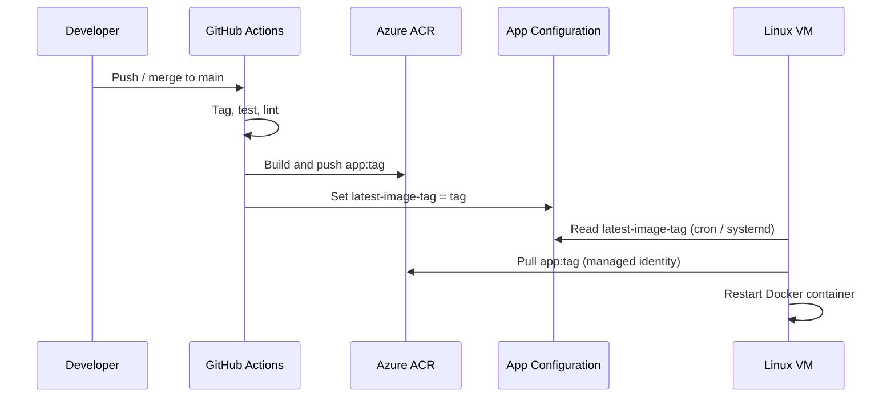

# Fully Automated Deployment on Azure (Terraform + GitHub Actions)

A hands-on DevOps demonstration that pairs a small **FastAPI** application with **Azure** infrastructure (provisioned by **Terraform**) and a full **GitHub Actions** CI/CD pipeline. Pushes to `main` run tests, build container images, push to **Azure Container Registry (ACR)**, and update **Azure App Configuration** so a VM can pull and run the latest version automatically.

## Overview

This repository shows an end-to-end delivery flow:

1. **Develop** — Python FastAPI app with health and version endpoints.
2. **Test & lint** — Pytest and Flake8 in GitHub Actions.
3. **Package** — Multi-stage Docker image (non-root user, Python 3.11).
4. **Publish** — Images pushed to ACR (and optionally Docker Hub).
5. **Deploy** — VM reads the desired image tag from App Configuration, pulls from ACR via managed identity, and runs the container behind a load balancer.

The VM does not receive deploy commands from the pipeline directly. Instead, GitHub Actions updates a key in App Configuration (`latest-image-tag`), and the VM’s bootstrap script plus a cron job reconcile to that tag every two minutes.

## Architecture

```
┌─────────────────┐     push to main      ┌──────────────────────┐
│  GitHub Actions │ ────────────────────► │ Azure Container      │
│  (OIDC login)   │                       │ Registry (ACR)       │
└────────┬────────┘                       └──────────┬───────────┘
         │                                           │
         │ set latest-image-tag                      │ docker pull
         ▼                                           ▼
┌─────────────────┐                       ┌──────────────────────┐
│ Azure App       │ ◄── read tag ──────── │ Linux VM (private    │
│ Configuration   │                       │ subnet, managed ID)  │
└─────────────────┘                       └──────────┬───────────┘
                                                       │
                                                       │ :8000
                                                       ▼
                                            ┌──────────────────────┐
                                            │ Standard Load        │
                                            │ Balancer (HTTP :80)  │
                                            └──────────┬───────────┘
                                                       │
                                                       ▼
                                                  Internet
```

### Azure resources (Terraform)

| Component | Purpose |
|-----------|---------|
| Resource group `devops-rg` | Holds all resources (West Europe) |
| Virtual network `10.0.0.0/16` | Public (`10.0.1.0/24`) and private (`10.0.2.0/24`) subnets |
| NAT gateway | Outbound internet for the private subnet |
| Linux VM `sample-app-vm` | Runs Docker; system-assigned managed identity |
| Standard load balancer | Fronts the app on port 80 → backend 8000; health probe on `/health` |
| Azure Container Registry | Stores `app:<tag>` images; admin disabled |
| Azure App Configuration | Stores `latest-image-tag` for desired deploy version |
| Azure AD app + federated credential | GitHub Actions OIDC (no long-lived secrets for ACR push) |

Role assignments wire **GitHub** (ACR push, App Configuration write) and the **VM** (ACR pull, App Configuration read).

## Application

The API lives in `app/` and is served by **Uvicorn** on port **8000**.

| Endpoint | Description |
|----------|-------------|
| `GET /` | Welcome message |
| `GET /health` | Health check (used by the load balancer probe) |
| `GET /version` | Returns `APP_VERSION` env var (default `1.0.0`) |

**Stack:** FastAPI, Uvicorn (see `app/requirements.txt`).

**Tests:** `app/test_main.py` — pytest against `/health`.

## Docker

The root `Dockerfile` uses a two-stage build:

- **Builder** — Installs Python dependencies into a prefix.
- **Runtime** — Slim image, non-root user `apprunner`, exposes 8000, runs `uvicorn main:app`.

Build context is the repository root; application code is copied from `app/`.

## CI/CD (GitHub Actions)

### On pull request / push to `main` (`actions.yaml`)

- Reusable **Build** workflow — Flake8 lint (syntax and style).
- Reusable **Test** workflow — `pytest` with `httpx` TestClient.

### On push to `main` (`tag-version.yaml`)

Triggered after merge to `main`:

1. **Auto-tag** — Computes next semantic tag (`v1.0.0`, then patch bump).
2. **Build** + **Test** — Same lint and test jobs as above.
3. **Docker Hub** — Builds and pushes `mfr0zen/devops_demo_azure:<tag>` (requires `DOCKER_USERNAME`, `DOCKER_PASSWORD`).
4. **Azure** — OIDC login, build/push to ACR as `app:<tag>`, updates App Configuration with the new tag.

### Reusable workflows

| Workflow | Role |
|----------|------|
| `build.yaml` | Flake8 |
| `test.yaml` | Pytest |
| `docker-build.yaml` | Docker Hub build/push |
| `azure.yaml` | ACR build/push + App Config key update |

## VM bootstrap and continuous deploy

`Terraform/userdata.sh` runs on first boot:

- Installs Docker, cron, Azure CLI.
- Writes `/usr/local/bin/deploy.sh` — logs in with VM managed identity, reads `latest-image-tag` from App Configuration, `docker pull` from ACR, restarts container `sample-app` on port 8000.
- Enables a **systemd** unit and a **cron** job (every 2 minutes) to re-run deploy.

Infrastructure templates pass ACR name, login server, App Configuration name, and port into the script.

## Project structure

```
.
├── app/
│   ├── main.py              # FastAPI application
│   ├── requirements.txt
│   └── test_main.py
├── Terraform/
│   ├── providers.tf         # azurerm ~> 4.0
│   ├── rg.tf, vnet.tf, *.tf # Network, VM, LB, ACR, App Config, IAM
│   ├── userdata.sh          # VM cloud-init deploy logic
│   └── output.tf            # OIDC client/tenant/subscription, LB IP/FQDN
├── .github/workflows/       # CI/CD pipelines
├── Dockerfile
└── README.md
```

## Prerequisites

- [Terraform](https://www.terraform.io/) >= 1.x
- [Azure CLI](https://learn.microsoft.com/en-us/cli/azure/install-azure-cli)
- Azure subscription with permissions to create resources and Entra ID apps
- SSH public key at `~/.ssh/id_rsa.pub` (used by `vm.tf` for VM admin access)
- GitHub repository with Actions enabled

For Terraform that manages **Azure AD** (application, service principal, federated credential), you also need the **azuread** provider configured in your environment (referenced in `az_app.tf`, `az_sp.tf`, `az_fic.tf`).

## Getting started

### 1. Clone the repository

```bash
git clone https://github.com/MFr0zen/DevOps_demo_Azure.git
cd DevOps_demo_Azure
```

### 2. Provision infrastructure

```bash
cd Terraform
terraform init
terraform plan
terraform apply
```

Note outputs for `client_id`, `tenant_id`, `subscription_id`, `load_balancer_public_ip`, and `load_balancer_fqdn`.

Update the federated identity **subject** in `Terraform/az_fic.tf` if you use a different GitHub org/repo or branch:

```hcl
subject = "repo:YOUR_ORG/YOUR_REPO:ref:refs/heads/main"
```

Set an initial App Configuration value (if not created in Terraform):

```bash
az appconfig kv set \
  --name <app-config-name> \
  --key latest-image-tag \
  --value v1.0.0 \
  --yes
```

### 3. Configure GitHub secrets

| Secret | Description |
|--------|-------------|
| `AZURE_CLIENT_ID` | Output `client_id` (GitHub OIDC app) |
| `AZURE_TENANT_ID` | Azure AD tenant |
| `AZURE_SUBSCRIPTION_ID` | Target subscription |
| `AZURE_CONTAINER_REGISTRY` | ACR name (without `.azurecr.io`) |
| `APP_CONFIG_NAME` | App Configuration store name |
| `IMAGE_TAG_PARAM` | Key name (e.g. `latest-image-tag`) |
| `RESOURCE_GROUP` | e.g. `devops-rg` |
| `DOCKER_USERNAME` / `DOCKER_PASSWORD` | Optional Docker Hub push |

Configure the `azure/login` federated credential to match your repository (see Terraform outputs and `az_fic.tf`).

### 4. Run locally

```bash
cd app
pip install -r requirements.txt
pip install httpx pytest
uvicorn main:app --reload --port 8000
```

Run tests:

```bash
pytest
```

Build and run with Docker from the repo root:

```bash
docker build -t devops-demo .
docker run -p 8000:8000 devops-demo
```

### 5. Access the deployed app

After the pipeline has pushed an image and the VM has pulled it:

- Load balancer FQDN: `terraform output load_balancer_fqdn`
- Or public IP: `terraform output load_balancer_public_ip`

Example: `http://<fqdn>/health`, `http://<fqdn>/version`.

## Deployment flow (summary)



## Security notes

- ACR admin is disabled; auth uses managed identity and OIDC.
- VM runs in a **private** subnet; inbound app traffic goes through the load balancer.
- NSG rules allow TCP 8000 from Azure Load Balancer and Internet (for the demo LB setup).
- Do not commit `.tfvars`, Terraform state, or `.env` files (see `.gitignore`).

## License

This project is intended as a **demo / learning** repository. Add a license file if you plan to distribute or reuse it formally.

## Author

Demo project by [MFr0zen](https://github.com/MFr0zen) — Azure DevOps pipeline with Terraform, GitHub Actions OIDC, ACR, and VM-based continuous deployment.
