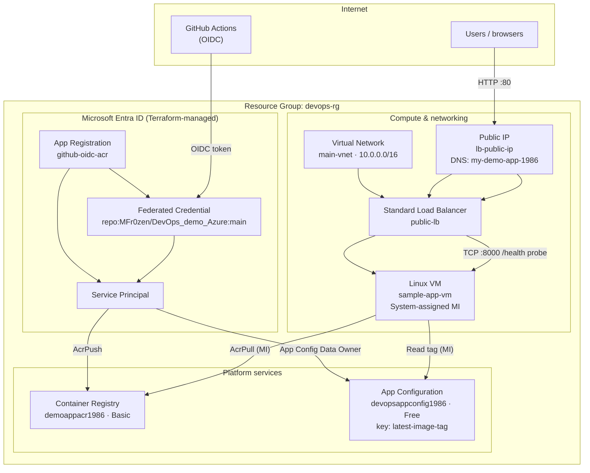
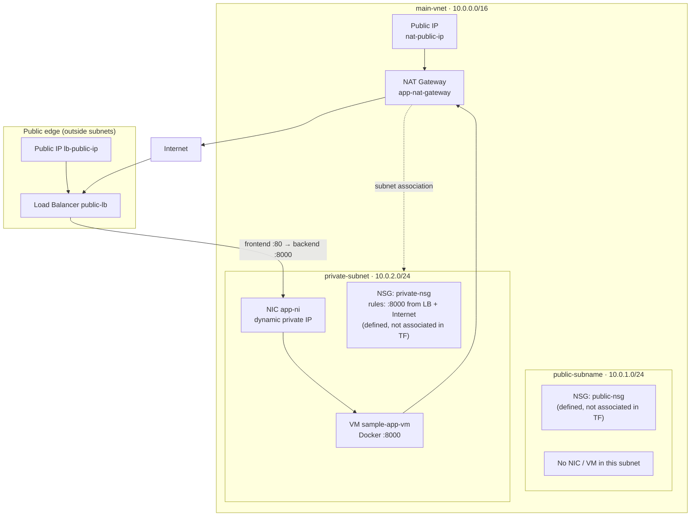
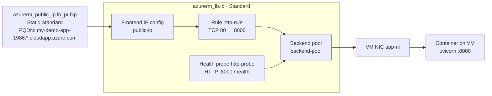
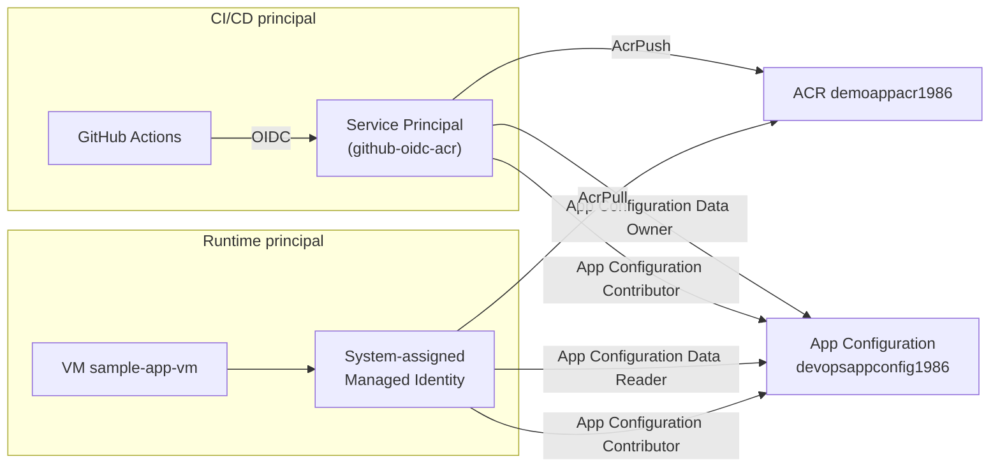
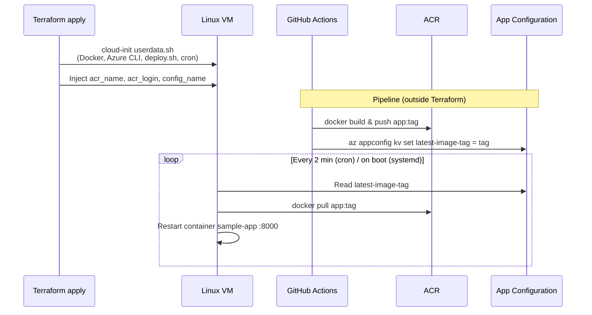

# Architecture Design

This document describes the Azure infrastructure defined in the `Terraform/` directory for the **DevOps Demo on Azure** project. It maps every provisioned object, how those objects relate, and how traffic, identity, and deployment flows move through the system.

**Scope:** West Europe (`local.location`), resource group `devops-rg`, environment label `demo`.

---

## 1. High-level topology

All Azure resources are grouped under a single resource group. External actors are **Internet users** (HTTP to the load balancer) and **GitHub Actions** (OIDC-based CI/CD).



### Design intent

| Layer | Responsibility |
|-------|----------------|
| **Edge** | Public load balancer terminates inbound HTTP on port 80 and forwards to the app on port 8000. |
| **Compute** | Single Linux VM in a private subnet runs the FastAPI app inside Docker. |
| **Registry** | ACR stores versioned container images (`app:<tag>`). |
| **Configuration** | App Configuration holds the desired image tag (`latest-image-tag`) for pull-based deploys. |
| **Identity** | GitHub Actions uses OIDC (no long-lived Azure secrets for registry push); the VM uses a system-assigned managed identity for pull and config read. |

---

## 2. Network layout

The virtual network uses a `/16` with two subnets. Only the **private** subnet hosts workloads; the **public** subnet is defined but unused in the current Terraform.



### Subnet and association matrix

| Resource | Subnet / placement | Terraform file |
|----------|-------------------|----------------|
| `azurerm_subnet.public` | `10.0.1.0/24` | `pubsubnet.tf` |
| `azurerm_subnet.private` | `10.0.2.0/24` | `privatesubnet.tf` |
| `azurerm_nat_gateway` + `nat-public-ip` | Associated to **private** subnet | `nat.tf` |
| `azurerm_network_interface.ni` | Private subnet | `ni.tf` |
| `azurerm_linux_virtual_machine.app` | Attached to NIC | `vm.tf` |
| `azurerm_lb` + `lb-public-ip` | Regional (not inside a subnet) | `lb.tf` |

### NSG rules (private-nsg)

Two inbound rules are defined on `private-nsg` (`nsg.tf`):

| Rule | Source | Port | Purpose |
|------|--------|------|---------|
| `allow-lb-to-app` | `AzureLoadBalancer` | 8000 | Load balancer health probe |
| `allow-internet-to-app` | `Internet` | 8000 | Application traffic forwarded by LB |

---

## 3. Load balancer

The Standard SKU load balancer exposes the application on port 80 and health-checks `/health` on port 8000.



### Terraform wiring

| Component | Resource | Relationship |
|-----------|----------|--------------|
| Public IP | `azurerm_public_ip.lb_pubip` | Front door; DNS label `my-demo-app-1986` |
| Frontend | `azurerm_lb.lb` → `frontend_ip_configuration` | References `lb_pubip` |
| Backend pool | `azurerm_lb_backend_address_pool.pool` | Member: VM NIC via `vm_assoc` |
| Health probe | `azurerm_lb_probe.http` | HTTP `:8000`, path `/health` |
| Rule | `azurerm_lb_rule.http` | `80 → 8000`, tied to probe and pool |

**Outputs:** `load_balancer_public_ip` and `load_balancer_fqdn` both read from `azurerm_public_ip.lb_pubip` (`output.tf`).

---

## 4. Compute and runtime

### Virtual machine

| Property | Value |
|----------|-------|
| Name | `sample-app-vm` |
| Size | `Standard_B2s_v2` |
| OS | Ubuntu 22.04 LTS (Canonical) |
| Admin user | `azvmuser` (SSH key from `~/.ssh/id_rsa.pub`) |
| Identity | System-assigned managed identity |
| Bootstrap | `userdata.sh` via `custom_data` |

On first boot, `userdata.sh` installs Docker, Azure CLI, and cron; writes `/usr/local/bin/deploy.sh`; enables a systemd unit and a cron job (every 2 minutes) to reconcile the running container with App Configuration.

### Deploy script behavior (runtime, not Terraform)

1. `az login --identity` (VM managed identity).
2. Read `latest-image-tag` from App Configuration.
3. `az acr login` + `docker pull <acr>/app:<tag>`.
4. Stop/remove container `sample-app`, run new container on port `8000`.

Template variables injected from Terraform (`vm.tf`):

- `acr_name` → `azurerm_container_registry.acr.name`
- `acr_login` → `azurerm_container_registry.acr.login_server`
- `config_name` → `azurerm_app_configuration.main.name`
- `app_port` → `8000`

---

## 5. Identity and RBAC

GitHub Actions authenticates with **OIDC**; the VM authenticates with a **system-assigned managed identity**. No ACR admin password is used (`admin_enabled = false` on ACR).



### Entra ID objects (`az_app.tf`, `az_sp.tf`, `az_fic.tf`)

```
azuread_application.github          display_name: github-oidc-acr
    ├── azuread_service_principal.github
    └── azuread_application_federated_identity_credential.github
            issuer:    https://token.actions.githubusercontent.com
            audiences: api://AzureADTokenExchange
            subject:   repo:MFr0zen/DevOps_demo_Azure:ref:refs/heads/main
```

### Role assignments (`roles.tf`)

| Principal | Scope | Role |
|-----------|-------|------|
| GitHub SP | ACR | `AcrPush` |
| GitHub SP | App Configuration | `App Configuration Data Owner` |
| GitHub SP | App Configuration | `App Configuration Contributor` |
| VM managed identity | App Configuration | `App Configuration Data Reader` |
| VM managed identity | App Configuration | `App Configuration Contributor` |
| VM managed identity | ACR | `AcrPull` |

Terraform outputs `client_id`, `tenant_id`, and `subscription_id` for configuring GitHub Actions secrets and OIDC login.

---

## 6. Platform services

### Azure Container Registry

| Property | Value |
|----------|-------|
| Name | `demoappacr1986` |
| SKU | Basic |
| Admin user | Disabled |
| Image format | `demoappacr1986.azurecr.io/app:<tag>` |

### Azure App Configuration

| Property | Value |
|----------|-------|
| Name | `devopsappconfig1986` |
| SKU | Free |
| Deploy key | `latest-image-tag` (set by GitHub Actions pipeline, not initial Terraform) |

The commented block in `az_app_conf.tf` shows an optional Terraform-managed default tag; production flow relies on the CI pipeline updating the key after each release.

---

## 7. Deployment and data flow

Terraform provisions infrastructure and VM bootstrap logic. **Image publish and tag updates** happen in GitHub Actions after `terraform apply`.



This is a **pull-based, config-driven** deploy model: the pipeline never SSHs to the VM; it only updates ACR and App Configuration, and the VM reconciles on a schedule.

---

## 8. Traffic paths

| Path | Route |
|------|--------|
| User → application | Internet → `lb-public-ip` → LB `:80` → VM NIC `:8000` → Docker / FastAPI |
| Load balancer health | LB probe → VM `:8000/health` |
| VM → internet (outbound) | Private subnet → NAT Gateway → `nat-public-ip` |
| VM → ACR | Managed identity, `AcrPull` |
| VM → App Configuration | Managed identity, data reader |
| GitHub → ACR | OIDC → service principal, `AcrPush` |
| GitHub → App Configuration | OIDC → service principal, write `latest-image-tag` |

---

## 9. Full resource inventory

```text
devops-rg (azurerm_resource_group.main)
│
├── NETWORK
│   ├── main-vnet (10.0.0.0/16)
│   │   ├── public-subname (10.0.1.0/24)          ← no workloads
│   │   └── private-subnet (10.0.2.0/24)
│   │       ├── NAT Gateway + nat-public-ip
│   │       └── NIC app-ni → VM
│   ├── public-nsg, private-nsg (+ inbound :8000 rules on private-nsg)
│   ├── public-lb (Standard)
│   │   ├── lb-public-ip (DNS: my-demo-app-1986)
│   │   ├── backend-pool → VM NIC
│   │   ├── http-probe (:8000 /health)
│   │   └── http-rule (80 → 8000)
│   └── NAT Gateway associated to private subnet only
│
├── COMPUTE
│   └── sample-app-vm (Ubuntu 22.04, Standard_B2s_v2)
│       ├── System-assigned managed identity
│       ├── SSH: azvmuser
│       └── custom_data → userdata.sh
│
├── REGISTRY & CONFIG
│   ├── demoappacr1986 (ACR Basic, admin disabled)
│   └── devopsappconfig1986 (App Configuration Free)
│
└── IDENTITY (Microsoft Entra ID)
    ├── App registration: github-oidc-acr
    ├── Service principal
    ├── Federated credential (GitHub OIDC)
    └── Role assignments (GitHub SP + VM MI)
```

### Terraform file map

| File | Resources |
|------|-----------|
| `providers.tf` | Provider, `azurerm_client_config` |
| `locals.tf` | Region, location, environment |
| `rg.tf` | Resource group |
| `vnet.tf` | Virtual network |
| `pubsubnet.tf` | Public subnet |
| `privatesubnet.tf` | Private subnet |
| `nat.tf` | NAT gateway, public IP, subnet association |
| `nsg.tf` | NSGs and inbound rules |
| `ni.tf` | VM network interface |
| `lb.tf` | Load balancer, public IP, pool, probe, rule |
| `vm.tf` | Linux VM, cloud-init |
| `userdata.sh` | Bootstrap and deploy script (templated) |
| `acr.tf` | Container registry |
| `az_app_conf.tf` | App Configuration store |
| `az_app.tf` | Entra application |
| `az_sp.tf` | Service principal |
| `az_fic.tf` | Federated identity credential |
| `roles.tf` | RBAC role assignments |
| `output.tf` | OIDC IDs, load balancer IP/FQDN |

---

## 10. Known gaps and extension points

| Item | Current state | Suggested follow-up |
|------|---------------|---------------------|
| NSG association | NSGs and rules exist but are not bound to subnets/NICs | Add `azurerm_subnet_network_security_group_association` on private subnet |
| Public subnet | Empty | Place bastion/jump box or remove if unused |
| Single VM | No HA | Add VMSS or second VM in backend pool |
| App Config initial tag | Not set in active Terraform | Set `latest-image-tag` manually or uncomment `azurerm_app_configuration_key` |
| Federated credential subject | Hard-coded to `MFr0zen/DevOps_demo_Azure` | Update `az_fic.tf` for forks or other branches |

---

## Related documentation

- [README.md](../README.md) — project overview, local development, and CI/CD setup
- `Terraform/` — source of truth for all resources described here
